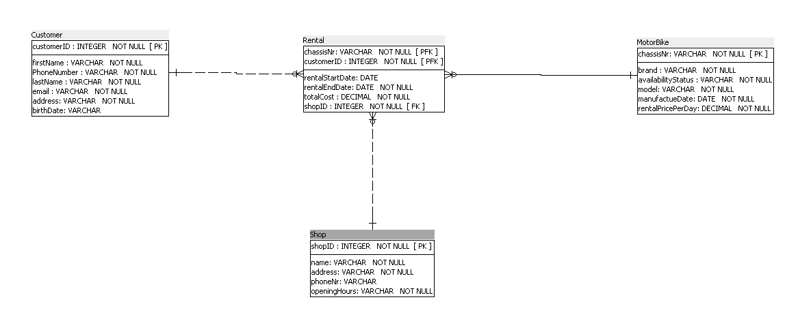
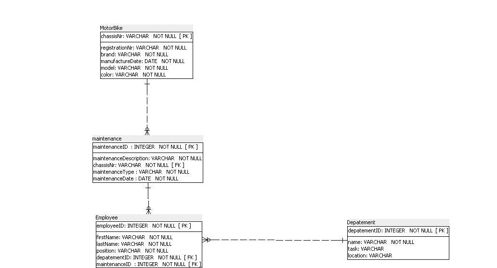

Student:
--------
Saif Qudaih & Said Khalaf 

Onderwerp: (veel op veel)
-------------------------
* MotorBikes - Customers
* MotorBikes - Employees

## Informatie:


>>>>>>> origin/main

## MotorBike
* ChassisNr
* RentalPricePerDay
* Brand
* Model
* availabilityStatus
* ManufactureYear


## Rental
* ChassisNr [PFK]
* CustomerID [PFK]
* RentalStartData
* TotalCost
* ShopID


## Customer

* CustomerID
* FirstName
* PhoneNr
* LastName
* Address
* Email
* Birthday

## Shop
* ShopID
* name
* Address
* OpeningHours

## S2 


## MotorBike
* ChassisNr
* RentalPricePerDay
* Brand
* Model
* Color 
* ManufactureYear

## Maintenance
* MaintenanceID
* MaintenanceDescription
* ChassisNr
* MaintenanceType
* MaintenanceDate

## Employee
* EmployeeID
* FirstName
* LastName
* Position
* DepartmentID

## Department
* DepartmentID
* Name
* Task
* Locatio
>>>>>>> origin/main

## Domain-Constraints 

```
S1:
* totalCost in "Rental" moet groter is dan 25
*  phoneNr van de Custome moet belgische Nr zijn start met "04"
```

```
S2:
* ManufactureDate van de MotorBike moet in het verleden.
* FirstName van Employee moet tussen 3 en 10 letters.
```

## Tijd 
```
* S1: Rental: RentalStartDate and  RentalEndDate has a history between.
* S2: the MotorBike has a manufactureDate. All child maintenances can be created after this date.   
```
```
Intermedierende entiteiten
* Rental: MotorBike - Customer 
* Maintenance:  MotorBike - Employee 
```

## Logische ERD
## S1


## S2



### informatie behoefte & Normalisatie 
### S1
[informatie behoefte S1.pdf](../S1/infromatiebehoefte S1.pdf) 

[Normalisatie S1.pdf](../S1/Normalisatie_S1_-_Blad1.pdf)

### S2
[informatie_behoefte S2.pdf](../S2/infromatiebehoefte S2.pdf)

[Normalisatie_MotorBike S2.pdf](../S2/Normalisatie_S2_-_Blad1.pdf)

## integratie 

[Normalisatie_MotorBike integratie.pdf](../SAMEN/Integratie_-_Blad1.pdf)


