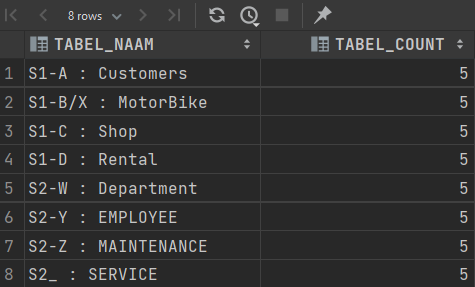
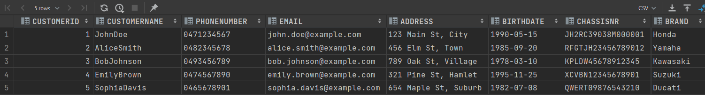
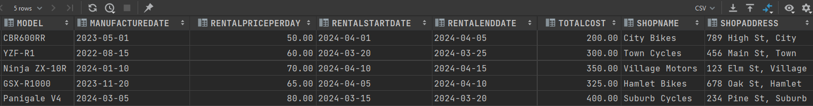
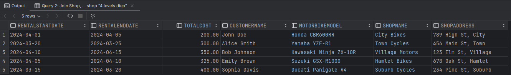
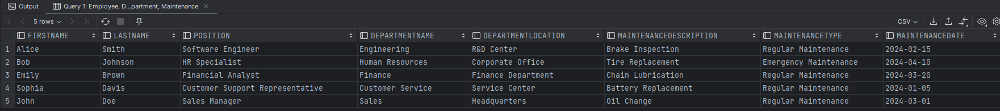
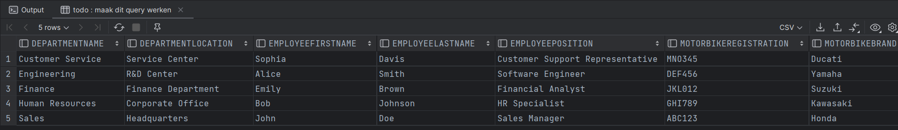
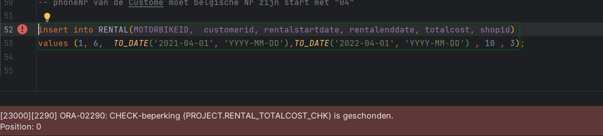
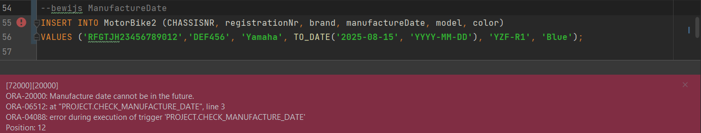
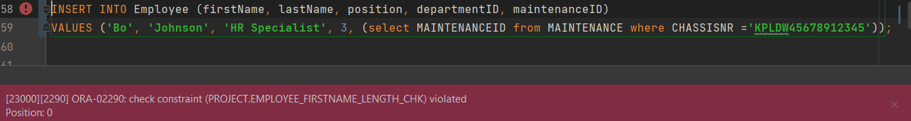

#### beschrijf de verdeling van de tabellen en het gebruik van identity columns in stap 
### Student 1
* Beschrijving van Tabelverdeling en Identity Columns
* Tabellen en hun Relaties:
``` 
Customer Table: Slaat persoonlijke informatie op van klanten die motorfietsen huren.
Elke klant heeft een uniek customerID, dat als identity column dient.
Dit zorgt ervoor dat elke klant een unieke identifier heeft en gemakkelijk opgezocht kan worden.

MotorBike Table: Bevat details van elke motorfiets, zoals merk, model, en beschikbaarheid. 
motorBikeID is hier de identity column en zorgt ervoor dat elke motorfiets uniek traceerbaar is.
Dit is belangrijk voor onderhoud, beschikbaarheid en huuradministratie.

Shop Table: Bevat informatie over de winkels waar de motorfietsen gehuurd en teruggebracht kunnen worden. 
shopID is de identity column die ervoor zorgt dat elke fysieke locatie een unieke identifier heeft.

Rental Table: Registreert de huurtransacties en verbindt de klanten, motorfietsen, en winkels. 
Er is geen identity column, omdat elke record een combinatie is van bestaande identity values uit de Customer, MotorBike, en Shop tabellen. 
Het veld chassisNr verbindt met de MotorBike tabel en customerID en shopID verbinden respectievelijk met de Customer en Shop tabellen.
```

### Student 2 
*  Beschrijving van Tabelverdeling en Identity Columns
* Tabellen en hun Relaties:

```
Tabellen en hun Relaties:
Department Table: Bewaart informatie over verschillende afdelingen binnen een organisatie. Elk departement heeft een uniek departmentID, 
dat als identity column dient. Dit zorgt ervoor dat elke afdeling een unieke identifier heeft,
wat handig is voor organisatorische indeling en rapportages.

Employee Table: Slaat persoonlijke informatie op van medewerkers. employeeID is hier de identity column,
wat betekent dat elke medewerker automatisch een uniek nummer krijgt toegewezen bij toevoeging aan de database.
Dit is essentieel voor het beheren van medewerkergegevens, salarisadministratie en het bijhouden van hun afdelings- en onderhoudsverbanden. 
departmentID en maintenanceID zijn foreign keys die respectievelijk verbinden met de Department en Maintenance tabellen.

MotorBike2 Table: Bevat details van elke motorfiets, zoals merk, model, kleur en fabricagedatum. 
chassisNr is de identity column die ervoor zorgt dat elke motorfiets uniek traceerbaar is. 
Dit is cruciaal voor het beheer van activa, onderhoudsplanning en het bijhouden van de motorfietsgeschiedenis.

Maintenance Table: Registreert onderhoudsactiviteiten voor motorfietsen. maintenanceID is de identity column, waardoor elke onderhoudsactiviteit een unieke identifier heeft. 
Dit helpt bij het efficiënt beheren van onderhoudsrecords en het waarborgen van kwaliteitscontrole. 
chassisNr dient als een foreign key die verwijst naar de MotorBike2 tabel om te verzekeren dat elke onderhoudsrecord gelinkt is aan een specifieke motorfiets.
```



### Query van Student 1
* Query 1: Join Customer, Rental, en MotorBike




*  Query 2: Join Shop, Rental, en MotorBike, shop "4 levels diep"



### Query van Student 2 
* Query 1: Employee, Department, Maintenance


* Query: Maintenance ,MotorBike2 ,Employee

************************************************************
### Stap 4: Bewijs Domeinen - constraints M2

#### Student 1
* totalCost in "Rental" moet groter is dan 25


** 2de fout Query 
* phoneNr van de Custome moet belgische Nr zijn start met "04"
  

**********
#### Student 2 
*  ManufactureDate van de MotorBike moet in het verleden


* FirstName van Employee moet tussen 3 en 10 letters.

